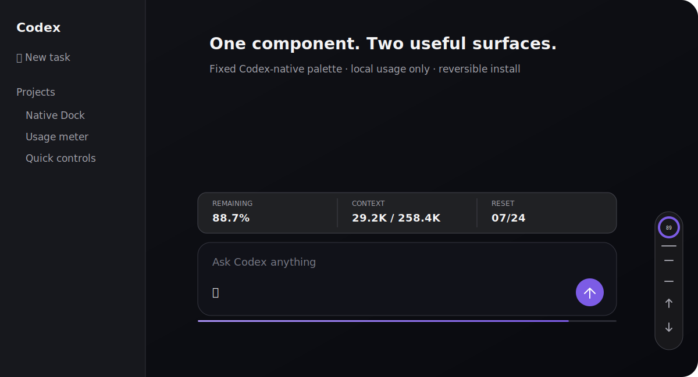

# Codex Native Dock

把“剩余额度细条”和“右下角快捷控制栏”合并成一个轻量组件，保持固定的 **Codex 原生深色配色**。它不会读取或自动适配 Dream Skin、长夜月、满穗或其他第三方主题。



## 功能

- 输入框下方显示剩余额度；悬停时只展开 **剩余百分比、上下文 Token、重置日期**。
- 条宽始终跟随当前输入框，打开/关闭左右区域或改变窗口大小时实时重算，不使用固定坐标。
- 右下角统一控制：专注计时、原生侧栏、当前/上一轮对话、最新消息。
- 专注模式收起 Codex 左侧栏，同时折叠自身的非必要按钮；退出后恢复进入前状态。
- ChatGPT 模式保留快捷控制，但不显示额度条（ChatGPT 额度不在这里伪造为 100%）。
- 账户额度从 Codex 已加载的本机账户状态读取；上下文 Token 从当前任务 JSONL 会话增量读取。数据不上传，也不扫描消息正文。

## 一键安装（Windows 11）

1. 从 [Releases](https://github.com/Alert886/Codex-Native-Dock/releases/latest) 下载 Windows ZIP 并完整解压。
2. 双击 `Install-Codex-Native-Dock.cmd`。
3. 如果 Codex 已打开且没有调试入口，安装器会先说明未发送文字可能丢失，再请求一次重启确认。

安装后可以删除解压目录。桌面和开始菜单会生成 `Codex Native Dock` 快捷方式。

系统若没有 Node.js 22+，安装器会从 `nodejs.org` 下载便携版，并使用官方 `SHASUMS256.txt` 校验后再启用。

## 恢复原生界面

双击 `Restore-Codex-Native-Dock.cmd`。恢复只移除本项目的 DOM、后台进程、快捷方式和 `%LOCALAPPDATA%\CodexNativeDock`，不会修改 Codex 安装文件。

## 开发与验证

```powershell
npm test
npm run check
```

实时验证（Codex 已通过本项目启动时）：

```powershell
powershell.exe -NoProfile -ExecutionPolicy RemoteSigned -File scripts\verify.ps1
```

源码分为三层：

- `src/renderer.js`：合并后的 DOM、交互和动态定位。
- `src/native-dock.css`：固定原生深色视觉，不做主题探测。
- `src/usage-store.mjs`：按当前任务 UUID 增量读取本机会话上下文 Token，并在原生账户状态暂不可用时提供额度回退值。
- `src/injector.mjs`：验证回环 CDP、注入、导航恢复和实时验证。

## 边界

- 当前一键安装支持 Microsoft Store 版 Codex for Windows。
- Codex 更新后，使用桌面快捷方式启动即可重新注入；无需修改或重打包 `app.asar`。
- 本项目不是 OpenAI 官方产品，详见 [NOTICE.md](NOTICE.md)。

## License

[MIT](LICENSE)
